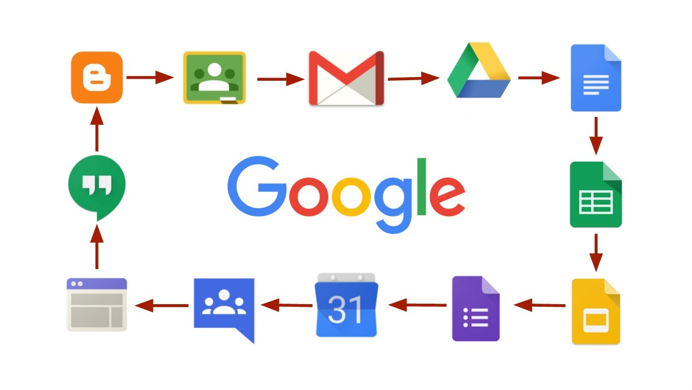

#  Narzędzia Google dla Edukacji

##  czym są Google Apps
Google Apps for Work (poprzednio Google Apps for Business) – działający w chmurze obliczeniowej pakiet zwiększający produktywność oraz oprogramowanie do pracy grupowej i oprogramowanie oferowane przez Google na zasadzie subskrypcj
Oprogramowanie obejmuje popularne aplikacje internetowe Google, w tym Gmail, Dysk Google, Spotkania Google, Kalendarz Google i Dokumenty Google[1]. O ile produkty te dla użytkowników prywatnych są dostępne bezpłatnie, Google Apps for Work oferuje dodatkowe, typowo biznesowe funkcje, takie jak możliwość stosowania indywidualnych adresów poczty elektronicznej z własną domeną (@twojafirma.com), minimum 30 GB przestrzeni dyskowej do przechowywania dokumentów i wiadomości e-mail oraz działający 24 godziny na dobę 7 dni w tygodniu dział pomocy technicznej dostępny za pośrednictwem poczty elektronicznej i telefonicznie[2]. Jako rozwiązanie oparte na chmurze obliczeniowej wykorzystuje inną koncepcję niż standardowe, zwiększające produktywność oprogramowanie biurowe, wprowadzając hosting informacji klienta w bezpiecznych centrach danych sieci Google[3], zamiast tradycyjnych serwerów wewnętrznych zlokalizowanych na terenie firm.[4]

                            (zródło: https://pl.wikipedia.org/wiki/Google_Apps)
